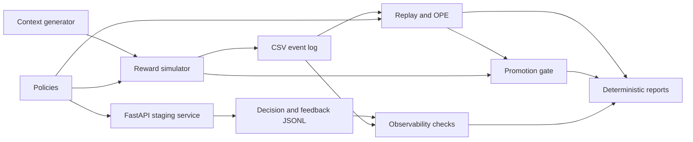

# Architecture

## Purpose

Contextual bandits choose one action for each observed context, receive feedback only
for that action, and use the feedback to improve later choices. They sit between
fixed business rules and full reinforcement learning: decisions are sequential, but
there is no long-horizon state or delayed return in this project.

Contextual Bandit Decision Ops exists as a compact, inspectable reference for the
whole decision lifecycle. It connects deterministic simulation, learning,
off-policy evaluation, safety gates, staging serving, and local monitoring without
claiming that synthetic evidence proves production readiness.

## System map

## Components

| Area | Main responsibility |
|---|---|
| `synthetic.py`, `simulation.py` | Generate contexts and Bernoulli rewards from fixed, documented probabilities. |
| `policies.py` | Provide random, fixed, oracle-assisted, and epsilon-greedy baselines. |
| `learning_policies.py`, `learning_evaluation.py` | Implement LinUCB, Linear Thompson Sampling, and sequential learning runs. |
| `evaluation.py` | Compare baseline policies on common simulated contexts. |
| `off_policy.py` | Estimate target-policy value from data logged by another policy. |
| `safety.py`, `promotion_gate.py` | Constrain action selection and turn evidence into `promote` or `hold`. |
| `service.py`, `api.py`, `api_schemas.py` | Serve staging decisions, accept feedback, and expose local counters. |
| `monitoring_metrics.py`, `drift_monitoring.py` | Analyze action, reward, feature, propensity, feedback, and service shifts. |
| `*_report.py` and CLI modules | Serialize reproducible Markdown and JSON artifacts. |

## Simulator and event model

The simulator creates users with age, engagement, and region features. Three
abstract actions (`0`, `1`, and `2`) have different context-dependent reward
probabilities. A reward is sampled from a Bernoulli distribution. Logged events
contain the event and user IDs, context, selected action, observed reward, true
simulation probability, behavior-policy propensity, timestamp, and seed.

The default behavior policy is uniform random, so every action has known support.
IDs and timestamps are derived deterministically rather than from wall-clock state.
Separate random-number streams keep policy selection and reward sampling
reproducible.

## Policy layers

Baseline policies establish interpretable reference points:

- random uniform explores all actions;
- fixed action always selects one action;
- epsilon-greedy mostly selects the best simulator action while retaining
  configurable exploration;
- the greedy oracle selects the action with the highest simulator reward
  probability.

The oracle-assisted policies are simulation diagnostics, not deployable policies:
real systems do not know counterfactual reward probabilities.

LinUCB maintains a ridge-regression estimate and confidence bonus per action.
Linear Thompson Sampling maintains a linear posterior approximation per action and
samples parameters before choosing. Both consume encoded context vectors and update
only from the selected action's observed reward.

## Evaluation paths

Two evaluation paths intentionally answer different questions:

1. Sequential simulation lets a policy choose, observe, update, and accumulate
   reward and regret against the simulator oracle.
2. Off-policy evaluation (OPE) reuses fixed logged data. Replay, IPS, SNIPS, and
   doubly robust estimators account for the fact that the behavior policy—not the
   target policy—selected the logged action.

Promotion gates combine these estimates with exploration, action coverage,
capacity, support, uncertainty, and regret checks. A higher estimated reward alone
is insufficient.

## Staging operations

The FastAPI app exposes `/health`, `/policy`, `/decide`, `/feedback`, and `/metrics`.
It writes append-only local JSONL decision and feedback records. The observability
command compares deterministic reference and current windows using transparent
statistics such as total variation distance, absolute rate changes, standardized
feature mean differences, and propensity bounds.

Docker packages the same CPU-only application, while GitHub Actions runs tests,
lint, and a service smoke check. `scripts/generate_demo.sh` is the canonical path
for regenerating the tracked reports.

## Trust boundaries

- All evidence is synthetic or local/staging evidence.
- Reward feedback is immediate and bounded to `[0, 1]`.
- There is no authentication, durable database, distributed coordination, or
  production telemetry.
- Oracle reward probabilities are retained only to test estimators and measure
  simulation regret.
- Determinism supports review and debugging; it does not represent live traffic
  variability.
